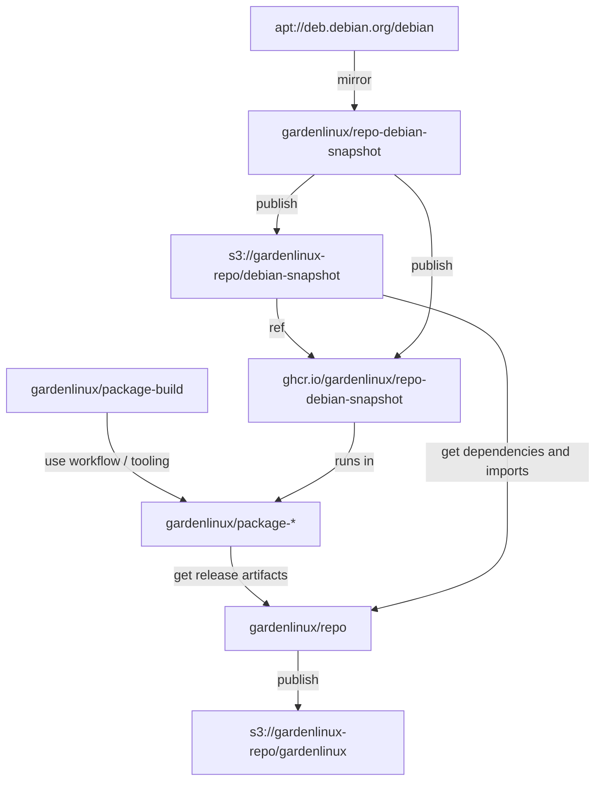

# Repository Infrastructure

This document provides a deep dive into the technical infrastructure that powers the Garden Linux repository system, including AWS setup, release processes and maintenance procedures.

## Release Hierarchy

Garden Linux uses a [three-tier release hierarchy](/explanation/release-hierarchy.md) to deliver a complete operating system.

This document is about the second tier, the [Repository Infrastructure](/explanation/repo-infrastructure).

## Debian Snapshots (`repo-debian-snapshot`)

The [`repo-debian-snapshot`](https://github.com/gardenlinux/repo-debian-snapshot) repository provides the foundation for reproducible builds in Garden Linux by creating and maintaining timestamped snapshots of the Debian testing repository.

### Purpose and Design Rationale

Debian testing is a continuously evolving distribution where package versions change frequently. To ensure reproducible builds, Garden Linux needs to freeze dependency versions at specific points in time. While the official Debian snapshot service (snapshot.debian.org) archives the entire history of Debian, Garden Linux maintains its own selective snapshots optimized for the distribution's specific needs.

The repo-debian-snapshot system was designed to address several requirements:

- **Reproducibility**: Creating immutable snapshots of Debian testing at regular intervals ensures that builds performed today will produce identical results when repeated in the future
- **Timestamp-Based Versioning**: Each snapshot receives a codename based on its creation timestamp (e.g., `1743532800`), allowing precise identification of which Debian state was used for any given build
- **Long-Term Validity**: Snapshot repository metadata is signed with a 100-year validity period, preventing expiration issues that would break older builds. In contrast, the official Debian snapshot service uses keys with much shorter validity periods, which can cause builds to fail when accessing older snapshots
- **Performance**: Lightweight metadata-only snapshots are faster to create and require less storage than archiving full package files
- **Control**: Garden Linux can create snapshots at precisely the times needed for releases rather than relying on external snapshot schedules
- **AWS Integration**: Tight integration with AWS infrastructure enables seamless signing, storage, and distribution
- **Focused Scope**: Snapshots contain only what Garden Linux needs (testing, specific architectures) rather than the entire Debian archive history

### What repo-debian-snapshot Does

The repo-debian-snapshot repository contains the automation and tooling to create snapshots of the Debian testing repository. The snapshot process works as follows:

1. **Mirror Creation**: The `mirror_apt_repo` script downloads package metadata (Packages and Sources files) from Debian testing for the architectures Garden Linux supports (amd64, arm64, and all). Rather than downloading all package files, it creates a minimal mirror containing only the metadata and a list of required packages.

2. **Package Selection**: The system parses the downloaded metadata to identify which packages are needed. This creates a "mirrorlist" of URLs pointing to the actual `.deb` files on Debian mirrors, allowing on-demand retrieval without storing copies of every package.

3. **Repository Generation**: The snapshot metadata is reorganized into a proper APT repository structure with:
   - Package index files compressed with gzip
   - SHA256 checksums for all files
   - An InRelease file containing the repository metadata and checksums
   - A validity period set to 100 years to prevent expiration issues

4. **Cryptographic Signing**: The InRelease file is signed using GPG with keys stored in AWS KMS. The signing process uses the `gnupg-pkcs11-scd` tool to integrate GPG with KMS, ensuring private keys never leave AWS infrastructure.

5. **Dual Publishing**:
   - **S3 Repository**: The snapshot APT repository is published to `s3://gardenlinux-repo/debian-snapshot/<timestamp>/` where it can be accessed by the `repo` assembly process
   - **Container Images**: A Debian-based container image is built that includes the snapshot's APT configuration, published to GHCR (`ghcr.io/gardenlinux/repo-debian-snapshot`)

### Usage in Garden Linux

Debian snapshots serve two critical roles:

1. **Build Environment**: Container images published to GHCR provide the build environment for `package-*` repositories. When a package is built, it runs inside a container based on a specific Debian snapshot, ensuring all build dependencies are at known versions. The container's `.container` file specifies which snapshot to use.

2. **Dependency Source**: During Garden Linux release assembly, the `repo` workflow fetches dependencies from the appropriate Debian snapshot. This ensures that all packages in a Garden Linux release use consistent dependency versions. The system queries the snapshot's package indices to resolve dependencies and downloads required packages from the Debian mirror as needed.

## AWS Infrastructure

Garden Linux leverages AWS services to host and distribute its package repositories:

### S3 Bucket Structure

The `gardenlinux-repo` S3 bucket is organized as follows:

- `/pool` - Contains all package files (.deb, .dsc, .tar.gz, etc.) used by both gardenlinux and debian-snapshot distributions
- `/gardenlinux` - Contains Garden Linux release distributions (dists/gardenlinux/\*)
- `/debian-snapshot` - Contains timestamp-indexed Debian testing snapshot distributions (dists/debian-snapshot/\*)

### CloudFront Distribution

- CloudFront ID: `E2RAO851VDQ2KX`
- Proxies the S3 bucket using a Lambda function (`repoPathRewrite`)
- Fixes an issue with AWS S3 HTTP endpoint handling `+` characters in filenames incorrectly
- Redirects all requests for `/*/pool` to `/pool` to allow sharing the pool directory between gardenlinux repo and debian-snapshot

### IAM Roles and Policies

- **Role**: `github-repo-oidc-role`
  - Allows GitHub Actions workflows from repositories matching `gardenlinux/repo-*` to access AWS resources
- **Policy**: `github-repo-policy`
  - Provides read/write access to the S3 bucket `gardenlinux-repo`
  - Grants access to the Garden Linux repository signing key stored in KMS

## Release Assembly Process

The `repo` repository orchestrates the creation of Garden Linux APT repository releases through automated workflows. These APT repositories contain the packages that Garden Linux OS images consume during builds.

:::info
This section describes **APT repository releases**. For information about **OS image releases** (which consume these APT repositories), see [Creating Major and Minor Releases](/how-to/releases/os-releases.md).
:::

Garden Linux produces two types of APT repository releases:

- **Nightly releases**: Automatically generated daily (e.g., `2150.0.0`)
- **Minor releases**: Manually created for specific updates (e.g., `2150.1.0`, `2150.2.0`)

### Nightly Releases

APT repositories for nightly releases are automatically generated by the `update.yml` GitHub Action that runs daily. These represent the latest state of Garden Linux with the newest custom-built packages and Debian snapshot dependencies.

Each nightly repository release follows a structured process:

1. **Release Tagging**: A new release is tagged with the [semantic versioning](/reference/glossary.html#semver) format `<version>.0.0` (e.g., `2150.0.0`), where the version number is derived from the build date. Each tag includes a generated `package-releases` file that pins specific versions of custom-built packages to be included in this release.

2. **Package Collection**: The system queries all `package-*` repositories to determine their build status:
   - For packages that have successfully built, the system retrieves the built artifacts (`.deb` files, source packages, etc.)
   - These artifacts are collected and prepared for inclusion in the APT repository
   - Packages that failed to build or are not ready are excluded from the release, ensuring only working packages are distributed

3. **Dependency Resolution**: For each package to be included in the release:
   - The system examines the package's declared dependencies
   - Required dependencies are fetched from the appropriate Debian snapshot repository
   - Both the package itself and its dependencies are included in the final repository
   - This ensures that all dependencies are available and versions are consistent across the entire release

4. **Repository Assembly**: All collected packages and dependencies are organized into a proper APT repository structure with package indices, metadata, and checksums.

5. **Cryptographic Signing**: The repository metadata is signed using the Garden Linux repository signing key stored in AWS KMS, ensuring authenticity and integrity.

6. **Publication**: The final signed APT repository is published to the S3 bucket at `s3://gardenlinux-repo/gardenlinux`, making it available for Garden Linux OS builds and users to install or update systems.

### Minor Releases

APT repository minor releases are manually created to update specific packages in an existing release. They are typically used to backport critical fixes, security updates, or specific package updates to already-published versions.

Key differences from nightly releases:

- **Manual Creation**: Minor releases are created manually by checking out a nightly release tag, modifying the `package-releases` and `package-imports` files, and creating a new tag with an incremented minor number (e.g., `2150.1.0`, `2150.2.0`)
- **Selective Updates**: Only specific packages are updated, rather than collecting the latest state of all packages
- **Version Increment**: The minor number (third component of semantic versioning) is incremented while the base version remains the same
- **Targeted Purpose**: Used for backporting specific fixes or updates to stable versions that users are already running

The assembly process for minor releases follows the same steps as nightly releases (dependency resolution, repository assembly, signing, publication), but operates on the manually curated `package-releases` and `package-imports` files rather than automatically generated ones.

For detailed instructions on creating APT repository minor releases, see [Creating APT Repository Minor Releases](/how-to/releases/apt-repos.md).

### Relationship to OS Releases

APT repository releases are consumed by Garden Linux OS builds:

1. An APT repository release is created (nightly or minor)
2. Garden Linux OS images are then built using packages from that APT repository
3. OS releases reference specific APT repository versions in their build configuration

This separation allows package updates to be tested and staged in APT repositories before being incorporated into OS images. For information about creating OS releases, see [Creating Major and Minor Releases](/how-to/releases/os-releases.md).

## Related Topics

<RelatedTopics />
